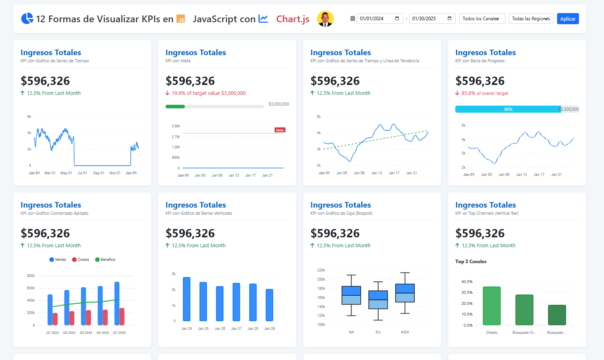

# 📊 Dashboard de KPIs Dinámico con JavaScript y ApexCharts 🚀

Este proyecto presenta un **Dashboard Interactivo y Dinámico para el Análisis de Indicadores Clave de Rendimiento (KPIs)**. Ha sido desarrollado para visualizar métricas cruciales de negocio, identificar tendencias de ingresos, analizar el rendimiento de canales de adquisición, desglosar datos por regiones y categorías de productos, permitiendo una toma de decisiones más informada y ágil.

El dashboard ofrece una visión completa del desempeño, utilizando más de 12 tipos de gráficos diferentes, filtros interactivos y un resumen ejecutivo dinámico, todo presentado en una interfaz de usuario moderna, intuitiva y totalmente responsiva, inspirada en la claridad de herramientas como Looker Studio.

[](https://developer.mozilla.org/es/docs/Web/Guide/HTML/HTML5)
[](https://developer.mozilla.org/es/docs/Web/CSS)
[](https://developer.mozilla.org/es/docs/Web/JavaScript)
[](https://apexcharts.com/)
[](https://getbootstrap.com/)
[](https://fontawesome.com/)
[](https://www.json.org/)

---

  <!-- 📸 REEMPLAZA ESTA URL con una captura de tu dashboard -->

## ✨ Características Clave

*   **📈 12 Formas de Visualizar KPIs**: Un conjunto diverso de gráficos que incluye:
    *   Series de Tiempo (con y sin línea de tendencia/rango objetivo)
    *   Barras de Progreso con Metas
    *   Gráficos Combinados Apilados (Columnas + Línea)
    *   Barras Verticales y Horizontales Apiladas
    *   Gráficos de Dona
    *   Boxplots (Diagramas de Caja)
    *   Barras y Áreas Apiladas al 100%
*   **🔍 Filtros Dinámicos e Interactivos**:
    *   📅 **Rango de Fechas**: Analiza el rendimiento en períodos específicos.
    *   📢 **Canal de Adquisición**: Compara el rendimiento de canales (Directo, Orgánico, Pagado, Referencia).
    *   🌍 **Región Geográfica**: Desglosa los datos por región (Norteamérica, Europa, Asia).
*   **📝 Resumen Ejecutivo Dinámico**:
    *   Una sección con narrativa inteligente generada automáticamente que destaca:
        *   💰 Ingresos totales y promedio diario del período seleccionado.
        *   📈 Tendencias generales de crecimiento o disminución.
        *   🎯 Progreso hacia los objetivos de ingresos.
        *   🆚 Comparación con el rendimiento del mes anterior (si aplica).
        *   🏆 Canales principales y categorías de productos con mejor rendimiento.
    *   Uso de formatos condicionales, iconos y emojis para una fácil comprensión.
    *   Sugerencias y próximos pasos basados en los datos analizados.
*   **🎨 Diseño Moderno y Responsivo**: Interfaz de usuario limpia y profesional, inspirada en Looker Studio, que se adapta fluidamente a diferentes dispositivos (escritorio, tablet, móvil).
*   **👤 Modal de Perfil del Creador**:
    *   Ventana modal con información sobre "Juancito Peña", incluyendo una breve biografía, servicios ofrecidos y enlaces a redes sociales.
*   **⚙️ Carga de Datos Centralizada**: Toda la información para los KPIs y gráficos se carga desde un archivo `data.json` externo, facilitando la actualización y el mantenimiento de los datos.
*   **💡 JavaScript Puro (Vanilla JS)**: Toda la lógica del frontend, incluyendo el manejo de filtros, cálculos de KPIs, renderizado de gráficos y actualizaciones del DOM, está implementada con JavaScript nativo (ES6+), promoviendo un código claro y eficiente sin dependencias de frameworks pesados.

## 🛠️ Tecnologías y Bibliotecas

*   **Lenguajes Fundamentales**:
    *   **HTML5**: Para la estructura semántica y el contenido del dashboard.
    *   **CSS3**: Para los estilos personalizados, la apariencia visual y el diseño responsivo.
    *   **JavaScript (ES6+)**: Para toda la lógica interactiva, manipulación de datos y del DOM.
*   **Visualización de Datos**:
    *   **ApexCharts.js**: Biblioteca principal utilizada para generar los 12 tipos de gráficos dinámicos, interactivos y estéticamente agradables.
*   **Frameworks CSS (Soporte)**:
    *   **Bootstrap 5**: Se utiliza principalmente para su sistema de rejilla robusto (`.kpi-grid`) y algunas utilidades de estilo y componentes básicos.
*   **Iconografía**:
    *   **Font Awesome 6**: Provee el conjunto de iconos utilizados a lo largo de la interfaz para mejorar la usabilidad y el atractivo visual.
*   **Formato de Datos**:
    *   **JSON (JavaScript Object Notation)**: Formato estándar utilizado para el archivo `data.json`, que actúa como la fuente de datos para el dashboard.

## 🚀 Cómo Empezar

Sigue estos pasos para ejecutar el proyecto en tu entorno local:

1.  **Clonar el Repositorio**:
    ```bash
    git clone https://github.com/JUANCITOPENA/Dashboard_12_Formas_De_Vusualizar_KPI.git
    cd Dashboard_12_Formas_De_Vusualizar_KPI 
    ```
 

2.  **Estructura de Archivos Esperada**:
    ```
    .
    ├── index.html         # La página principal del dashboard
    ├── style.css          # Todos los estilos CSS
    ├── script.js          # Toda la lógica JavaScript
    └── data.json          # Archivo con los datos para los KPIs y gráficos
    ```

3.  **Abrir en el Navegador**:
    *   Puedes abrir `index.html` directamente en tu navegador web.
    *   **Recomendado**: Para una mejor experiencia de desarrollo y para evitar problemas con la política de CORS al cargar `data.json` mediante `fetch`, utiliza un servidor de desarrollo local. Si usas VS Code, la extensión "Live Server" es una excelente opción.

4.  **Interactuar con el Dashboard**:
    *   📊 Explora los 12 KPIs y gráficos visualizados.
    *   🖱️ Utiliza los filtros de Fecha, Canal y Región. Observa cómo los KPIs, gráficos y el Resumen Ejecutivo se actualizan dinámicamente.
    *   👤 Haz clic en la imagen de perfil en la cabecera, o en el nombre "Juancito Peña" o la imagen de perfil en el pie de página, para abrir la modal con la información del creador.

## 📄 Archivo `data.json`

Este archivo es la columna vertebral de la información del dashboard. Su estructura es clave:

*   `kpiSummary`: Contiene valores base para los KPIs principales (ej. `changeFromLastMonth`, `targetValue`, `overallTarget`). El valor de `totalRevenue` en este objeto se **recalcula dinámicamente** por el script basándose en la suma del `timeSeriesData` (completo o filtrado).
*   `timeSeriesData`: Un array de objetos, donde cada objeto representa un punto de datos diario y **debe incluir** `date` (YYYY-MM-DD), `value` (numérico), `channel` (ej. "directo", "organico"), y `region` (ej. "na", "eu", "asia") para el correcto funcionamiento de los filtros.
*   `channelData`: Datos agregados por canal, utilizados para el gráfico de dona y el de top canales. Debe incluir `name` (ej. "Directo") y `value`.
*   `productCategoryRevenue`: Datos para el gráfico de rendimiento por categoría de producto.
*   Otras secciones (`stackedComboData`, `boxplotData`, `trendlineTargetRangeData`, `progressLineTrendValue`, `stackedBar100Data`, `stackedArea100Data`) contienen datos predefinidos para sus respectivos gráficos y, en la implementación actual, no se filtran dinámicamente por los selectores de canal/región (aunque `boxplotData` podría adaptarse si sus categorías `x` coincidieran con los valores del filtro de región).

**Para usar tus propios datos**: Modifica `data.json` manteniendo la estructura. El `script.js` está diseñado para calcular y mostrar los datos correctamente siempre que la estructura se respete.

## 💡 Posibles Mejoras y Próximos Pasos

*   **Análisis Detallado por Gráfico**: Implementar modales individuales que se abran al hacer clic en cada gráfico, ofreciendo desgloses más profundos y visualizaciones secundarias específicas.
*   **Comparativas Avanzadas**: Añadir opciones para comparar con períodos anteriores directamente en los gráficos o en el resumen.
*   **Exportación de Datos/Gráficos**: Permitir a los usuarios descargar los datos filtrados (CSV) o los gráficos (PNG/SVG).
*   **Temas Visuales**: Opción para alternar entre un tema claro y uno oscuro.
*   **Optimización**: Para conjuntos de datos extremadamente grandes, considerar la carga progresiva o virtualización de datos.
*   **Internacionalización (i18n)**: Adaptar el dashboard para soportar múltiples idiomas.

## 🤝 Contribuciones

¡Las ideas y contribuciones son siempre bienvenidas! Si deseas mejorar este proyecto:

1.  Realiza un **Fork** del repositorio.
2.  Crea una nueva **Rama** (`git checkout -b mi-mejora-increible`).
3.  Implementa tus cambios y realiza **Commit** (`git commit -m 'Añadida nueva funcionalidad X'`).
4.  Haz **Push** a tu rama (`git push origin mi-mejora-increible`).
5.  Abre un **Pull Request**.

## 📜 Licencia

Distribuido bajo la Licencia MIT. Ver el archivo `LICENSE` (si existe en tu repositorio) para más información.

## 📬 Contacto

**Juancito Peña**

## 📬 Contacto

**Juancito Peña**

*    GitHub: [@juancitopena](https://github.com/juancitopena) 
*   💼 LinkedIn: [Juancito Peña V.](https://www.linkedin.com/in/juancitope%C3%B1a/)
*   📧 Email: `juancito.pena@gmail.com`

Enlace al Proyecto: [https://github.com/TU_USUARIO_GITHUB/TU_REPOSITORIO](https://github.com/TU_USUARIO_GITHUB/TU_REPOSITORIO) <!-- Reemplaza con el enlace real a tu repositorio -->

--- 

Enlace al Proyecto: [https://github.com/TU_USUARIO/TU_REPOSITORIO](https://github.com/TU_USUARIO/TU_REPOSITORIO) <!-- Reemplaza -->

---

## 🙏 Agradecimientos y Créditos Especiales

Este proyecto, aunque desarrollado desde cero con las tecnologías mencionadas, se ha inspirado y ha tomado ideas visuales de varios trabajos y diseñadores talentosos en la comunidad de visualización de datos. Queremos expresar nuestro sincero agradecimiento a:

*   **Maksim Perapialitsa**: Por la inspiración general en el diseño y la estructura visual del dashboard. Su trabajo es una referencia en claridad y efectividad.
    *   Puedes ver un ejemplo de su enfoque en este [diseño original](https://lookerstudio.google.com/reporting/0c7b52c8-dc1e-4a07-84c4-829ae1d6dc6e/page/p_fy2mducisd) que sirvió como una de las fuentes de inspiración.
*   **Siavak.com**: Por las ideas conceptuales para pop-ups de visualización comunitaria y la interacción con datos.
*   **Mehdi Oudjida**: Por la inspiración en el diseño de gráficos de líneas que muestran mínimos y máximos de manera efectiva.
*   **Ellen Blackburn**: Por sus aportes y paletas categóricas que influyeron en la selección de colores y la estética visual.

Un agradecimiento especial también a **Irene Diomi, Chimdi Nwosu, y Harry Beardon** por sus contribuciones y debates en la comunidad de visualización de datos, que siempre impulsan la creatividad y la excelencia.

Este dashboard es un esfuerzo por aplicar y combinar algunas de estas brillantes ideas en un proyecto funcional y educativo. ¡La visualización de datos es un campo colaborativo y estamos agradecidos por la inspiración que la comunidad proporciona! 🌟

---

¡Gracias por darle un vistazo a este Dashboard de KPIs! Esperamos que te sirva de inspiración y como una herramienta útil. ¡Feliz codificación! 👨‍💻✨
